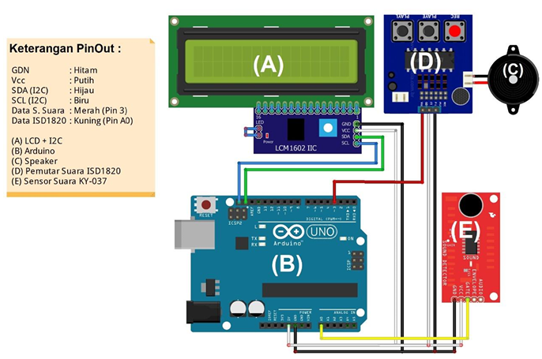

<div class="" align="center">
    <p>Deteksi Kebisingan</p>
    <h1>Alat Deteksi Kebisingan Pada Perpustakaan</h1>
    <span>✨⭐⭐⭐✨</span>
    <span>Sistem ini mendeteksi suara menggunakan sensor analog di A0. Jika suara melebihi 44.40, sistem akan: Menampilkan pesan peringatan di LCD. Mengaktifkan modul suara (ISD1820). Membunyikan buzzer/speaker. Jika suara normal, LCD menampilkan "Status: Normal".</span>
    <hr>
    <p>Desain rancagan</p>
    
    <br>
</div>

## Setup Project ==============================
<strong>PANDUAN Instalasi</strong>

- 📍&nbsp;&nbsp;[Arduino)](https://support.arduino.cc/hc/en-us/articles/360019833020-Download-and-install-Arduino-IDE)

- setelah app arduino terinstall
- dan rangkaian sudah jadi
- selanjutnya buka aplikasi arduino
- intsal library LCD 16X2 I2C dengan cara buka menu 
    - Sketch > Include Library > Manage Libraries 
    - dan cari LiquidCrystal I2C kemudian instal.
- setelah terinstall kemudian copy code yang ada di file deteksi_kebisingan.ino ke dalam teks editor arduinonya
- langkah terakhir jalankan atau upload

## PENJELASAN ALUR ==============================
<strong>CARA KERJA ALAT</strong>
--------------------------------------------------
1. Library dan Definisi Pin
```
#include <Wire.h>
#include <LiquidCrystal_I2C.h>  // Library untuk LCD I2C

#define SENSOR_PIN A0        // Data Sensor Suara
#define ISD_PIN 3            // Data ISD1820
#define SPEAKER_PIN 8        // Pin untuk speaker tambahan
```
Wire.h: Library untuk komunikasi I2C.
LiquidCrystal_I2C.h: Library untuk mengontrol LCD dengan modul I2C.
Pin Definitions:
SENSOR_PIN A0: Pin analog untuk membaca data sensor suara.
ISD_PIN 3: Pin digital untuk mengontrol modul ISD1820 (modul perekam & pemutar suara).
SPEAKER_PIN 8: Pin digital untuk speaker/buzzer tambahan.
--------------------------------------------------
2. Variabel Global
```
int sensorValue = 0;          // Nilai baca sensor
int averageValue = 0;         // Rata-rata nilai sensor
const int threshold = 44.40;  // Ambang batas suara keras
String peringatan1 = "RIBUT! "; // Pesan LCD baris 1
String peringatan2 = "ANDA BISA DIAM!"; // Pesan LCD baris 2
```
threshold: Jika nilai sensor melebihi ini, sistem menganggap suara terlalu keras.
--------------------------------------------------
3. Fungsi setup()
```
void setup() {
  Serial.begin(9600);  // Mulai komunikasi serial
  
  lcd.init();          // Inisialisasi LCD
  lcd.backlight();     // Nyalakan backlight
  lcd.print("Sistem Deteksi"); // Pesan awal
  lcd.setCursor(0, 1);
  lcd.print("    Suara");
  delay(2000);         // Tampilkan pesan selama 2 detik
  lcd.clear();         // Bersihkan LCD
  
  pinMode(ISD_PIN, OUTPUT);     // Set ISD_PIN sebagai output
  digitalWrite(ISD_PIN, LOW);   // Matikan modul ISD1820
  pinMode(SPEAKER_PIN, OUTPUT); // Set SPEAKER_PIN sebagai output
  digitalWrite(SPEAKER_PIN, LOW); // Matikan speaker
}
```
Serial Monitor: Digunakan untuk debugging/monitoring nilai sensor.
LCD: Menampilkan pesan awal saat sistem mulai.
Pin Mode: Konfigurasi pin sebagai output.
--------------------------------------------------
4. Pembaca sensor
```
averageValue = 0;
for (int i = 0; i < 10; i++) {
  sensorValue = analogRead(SENSOR_PIN); // Baca sensor
  averageValue += sensorValue;         // Akumulasi nilai
  delay(10);  // Delay antar pembacaan
}
averageValue /= 10;  // Hitung rata-rata
```
Mengambil 10 sampel dari sensor suara dan menghitung rata-ratanya untuk mengurangi noise.
--------------------------------------------------
5. Deteksi Suara
```
if (averageValue > threshold) {
  Serial.println(" - Suara keras terdeteksi!");
  
  // Tampilkan pesan peringatan di LCD
  lcd.setCursor(0, 0);
  lcd.print(peringatan1);
  lcd.setCursor(0, 1);
  lcd.print(peringatan2);
  
  // Aktifkan modul ISD1820 (rekam/putar suara)
  digitalWrite(ISD_PIN, HIGH);
  delay(500);  // Tahan HIGH untuk trigger modul
  digitalWrite(ISD_PIN, LOW);
  
  // Bunyikan speaker/buzzer
  tone(SPEAKER_PIN, 1000, 1000);  // 1 kHz, 1 detik
  
  delay(15000);  // Jeda 15 detik sebelum deteksi berikutnya
  lcd.clear();   // Bersihkan LCD
}
```
Jika suara melebihi threshold:
Tampilkan pesan "RIBUT! ANDA BISA DIAM!" di LCD.
Trigger modul ISD1820 (misalnya memutar rekaman peringatan).
Bunyikan speaker/buzzer dengan frekuensi 1 kHz selama 1 detik.
Beri jeda 15 detik sebelum deteksi berikutnya.
------------------------------------------------------
6. kondisi normal
```
else {
  Serial.println(" - Kondisi normal");
  
  // Tampilkan status normal di LCD
  lcd.setCursor(0, 0);
  lcd.print("Status:");
  lcd.setCursor(0, 1);
  lcd.print("Normal");
  
  delay(1000);
  lcd.clear();
}
```
Jika suara di bawah threshold, tampilkan "Status: Normal" di LCD.
------------------------------------------------------
7. Delay Antar Pembacaan
```delay(100);  // Jeda antar pembacaan```


## FunForCode
#Elqusairi